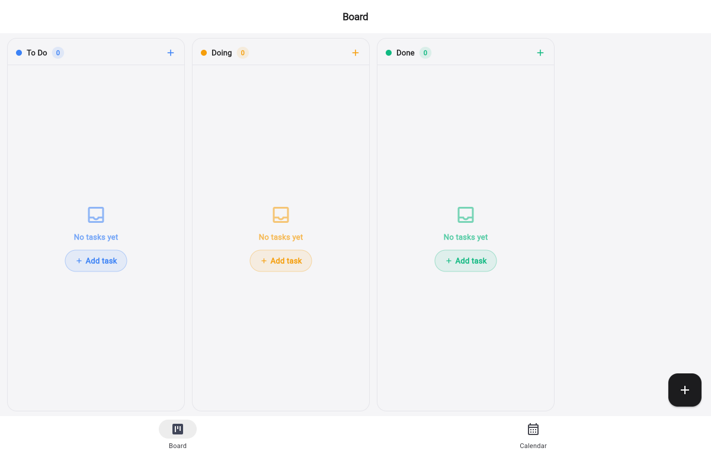
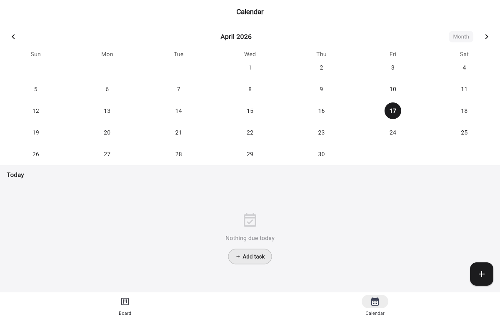

# Aline

A local-first kanban board and calendar app built with Flutter. All data is stored on-device using SQLite — no account or internet connection required.

## Features

- **Kanban board** — three-column workflow (To Do / Doing / Done) with drag-and-drop reordering
- **Calendar view** — visualise tasks by due date in month or week format
- **Categories** — colour-coded labels to organise tasks
- **Offline-first** — powered by [Drift](https://drift.simonbinder.eu) (SQLite) with zero network dependency
- **Cross-platform** — runs on iOS, Android, and Web

## Screenshots

| Board | Calendar |
|-------|----------|
|  |  |

## Getting Started

### Prerequisites

| Tool | Version |
|------|---------|
| Flutter | ≥ 3.11 |
| Dart | ≥ 3.11 |

Install Flutter by following the [official guide](https://docs.flutter.dev/get-started/install).

### Installation

```bash
# 1. Clone the repository
git clone https://github.com/retraca/aline.git
cd aline

# 2. Install dependencies
flutter pub get

# 3. Generate Drift database code
dart run build_runner build --delete-conflicting-outputs
```

### Running

**Mobile (iOS / Android)**
```bash
flutter run
```

**Web**

Web requires two extra files for the SQLite WASM backend. Generate them once:

```bash
# Copy the sqlite3 WASM module from the Drift package
cp $(flutter pub cache list | grep -o ".*drift-[0-9.]*")/extension/devtools/build/sqlite3.wasm web/sqlite3.wasm

# Compile the Drift web worker
dart compile js -O4 web/drift_worker.dart -o web/drift_worker.dart.js
```

Then run:
```bash
flutter run -d chrome
```

Or build a production release:
```bash
flutter build web --release
# Copy WASM assets
cp web/sqlite3.wasm build/web/sqlite3.wasm
cp web/drift_worker.dart.js build/web/drift_worker.dart.js
# Serve the build directory with any static file server
python3 -m http.server 8080 --directory build/web
```

## Project Structure

```
lib/
├── app.dart                  # Router and shell (bottom nav)
├── main.dart
├── core/
│   └── theme/app_theme.dart  # Colours, text styles, component themes
├── data/
│   ├── database/
│   │   ├── app_database.dart # Drift schema and queries
│   │   └── app_database.g.dart
│   └── providers.dart        # Riverpod providers
└── features/
    ├── board/
    │   ├── board_screen.dart
    │   └── widgets/
    │       ├── kanban_column.dart
    │       ├── task_card.dart
    │       └── task_form_sheet.dart
    └── calendar/
        └── calendar_screen.dart
```

## Tech Stack

| Layer | Package |
|-------|---------|
| State management | [flutter_riverpod](https://riverpod.dev) + riverpod_generator |
| Database | [Drift](https://drift.simonbinder.eu) (SQLite) |
| Navigation | [go_router](https://pub.dev/packages/go_router) |
| Calendar widget | [table_calendar](https://pub.dev/packages/table_calendar) |

## Contributing

Pull requests are welcome. For larger changes, please open an issue first to discuss what you'd like to change.

1. Fork the repo
2. Create a feature branch (`git checkout -b feat/my-feature`)
3. Commit your changes
4. Open a pull request

## License

MIT
